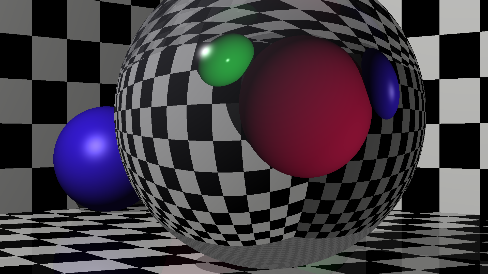
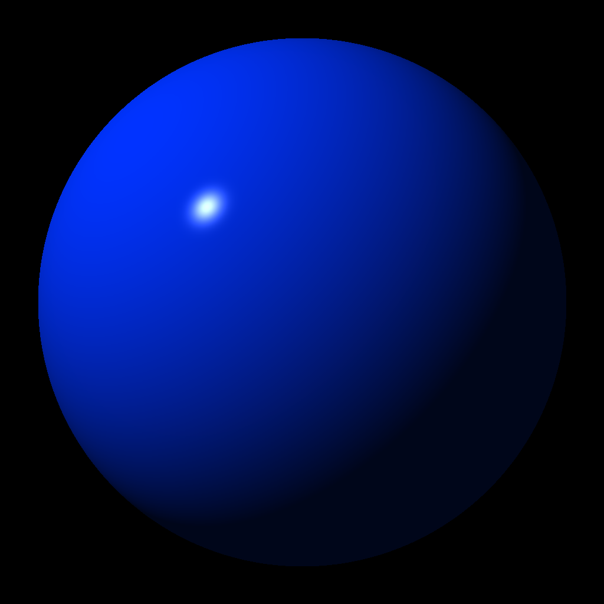

# GoTracer
A ray tracer written in Go following the [The Ray Tracer challenge](https://pragprog.com/book/jbtracer/the-ray-tracer-challenge)

_Reflection/Refraction_

_Soft Shadows_

_Cylinders_

_Table_

_Refraction_

_Default scene_

_Sphere_

### Features
- Primitives (Spheres, Cubes, Cones, Cylinders, Planes, Triangles, CSG)
- Point and Area Lights
- Support for multiple lights
- Bounding Volume Hierarchy(BVH) / Bounding Box
- Phong Shading, Shadows, Reflection, Refraction
- Soft Shadows
- Groups
- .obj file parsing and triangulation
